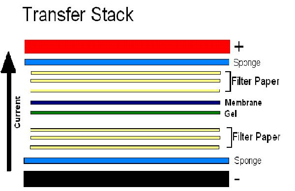

### OBJECTIVE
 

To transfer protein samples electrophoretically from polyacrylamide gel to PVDF membrane

### THEORY

Blotting is a technique for the electrophoretic transfer of DNA, RNA or protein to a suitable membrane. The method most commonly used for the electrotransfer of proteins to nitrocellulose is that reported by Towbin et al. (1979). This technique was patented in 1989 by William J. Littlehales under the title "Electroblotting technique for transferring specimens from a polyacrylamide electrophoresis or like gel onto a membrane." Transfer of the proteins can be carried out using several methods such as vacuum, capillary or electric field. Electroblotting is by far the most wide-spread technique which utilizes either vertical buffer tanks or semi-dry blotting.

In order to take advantage of this technique for the purpose of amino acid analysis or N-terminal sequencing, the proteins must be transferred to a membrane that is stable to the chemicals used in these analytical procedures. For protein sequencing and amino acid analysis the proteins are transferred to a chemically stable membrane, polyvinylidene difluoride (PVDF). PVDF membranes bind proteins primarily through hydrophobic interactions and are commonly used for their chemical resistance as well as physical stability. Electrophoretic transfer is performed by placing the gel next to the membrane in a special cassette that, inturn, is placed in a tank of electrophoretic buffer (tank electroblotting). Proteins are first separated by SDS-PAGE, the gel is removed from the electrophoresis cassette (do not stain the gel before blotting) and equilibrated in transfer buffer without methanol. The PVDF membrane is "activated" by dipping it in methanol; it is then placed in transfer buffer containing methanol. The gel-PVDF sandwich is placed in a specially designed holder that in turn is placed in the buffer-containing electrophoresis unit. Upon application of voltage gradient perpendicular to the direction of the initial electrophoresis the gel, the sample migrates out of the gel and onto the filter paper; this is essentially the standard transfer methodology for western blot. At the pH of the buffer (pH 8.3) most proteins are negatively charged and will migrate to the anode (positive electrode). In case one suspects the protein has a pI greater than 8.3, a PVDF membrane can be placed at the cathode-side of the gel as well. Alternatively, the pH of the transfer buffer can be adjusted to a higher pH. After transfer, the membrane is stained with Coomassie Blue R-250 and destained to locate the protein bands. Sections containing the proteins bands can then be excised for amino acid analysis and N-terminal protein sequencing.

 

Another form of this technique, known as semi-dry blotting, requires only a minimal amount of buffer to saturate the membrane and blotting papers, establishing electrical contact between the gel and apparatus itself. The advantage is that low voltage and current are need for transfer, precluding the requirement for a high current power supply. Either nylon or nitrocellulose may be used for electroblotting. Due to the production of heat during electroblotting, cool the electrolyte buffer prior to use as well as controlling the temperature during the run. Efficiency of electroblotting is dependent upon structural parameters of the membrane, including specific surface area, pore size distribution and pore volumes. Almost quantitative retention (>90%) of proteins was obtained for membranes with a high specific surface area and narrow pores.
